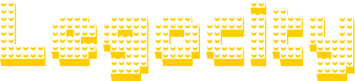

<p align="center">
  <a href="https://www.linkedin.com/in/zakharb/awsconnect">
  
</p>

<p align="center">

<a href="https://git.io/typing-svg">
  
</p>

<p align="center">
  
  
  
</p>


## :yellow_square: Getting Started

[Legocity](https://github.com/zakharb/legocity) is micropython library to work with borads like ESP32     

### Installing tools

Install via `pip`
```sh
python3 -m pip pip install adafruit-ampy
python3 -m pip pip install esptool

export AMPY_PORT=/dev/ttyUSB0 
```

## :yellow_square: Firmware  

Download [firmware](https://micropython.org/download/esp32/)
```sh
python3 -m esptool --port /dev/ttyUSB0 erase_flash
python3 -m esptool --chip esp32 --port /dev/ttyUSB0 write_flash -z 0x1000 esp32-20220117-v1.18.bin
```

## :yellow_square: Configure boot, wlan

boot.py file listing
```sh
~/.local/bin/ampy put boot.py
```

wifi.py file listing
```sh
import network
wlan = network.WLAN(network.STA_IF)
wlan.isconnected()
wlan.active(True)
wlan.ifconfig()
wlan.scan()
wlan.connect('lego_city', '')
```

Get list files on board
```sh
~/.local/bin/ampy ls
```

Copy files to board  
```sh
~/.local/bin/ampy put boot.py wifi.py main.py
```

## :yellow_square: Versioning

Using [SemVer](http://semver.org/) for versioning. For the versions available, see the [tags on this repository](https://github.com/zakharb/awsconnect/tags). 

## :yellow_square: Authors

* **Zakhar Bengart** - *Initial work* - [Ze](https://github.com/zakharb)

See also the list of [contributors](https://github.com/zakharb/awsconnect/contributors) who participated in this project.

## :yellow_square: License

This program is free software: you can redistribute it and/or modify it under the terms of the GNU General Public License as published by the Free Software Foundation - see the [LICENSE](LICENSE) file for details  


